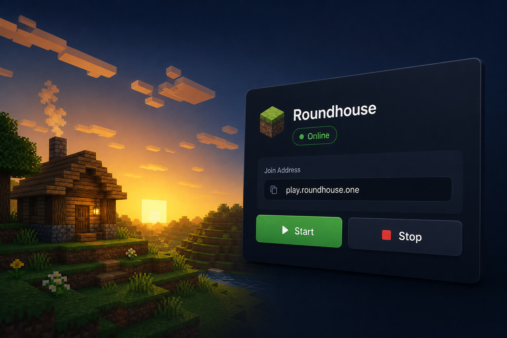
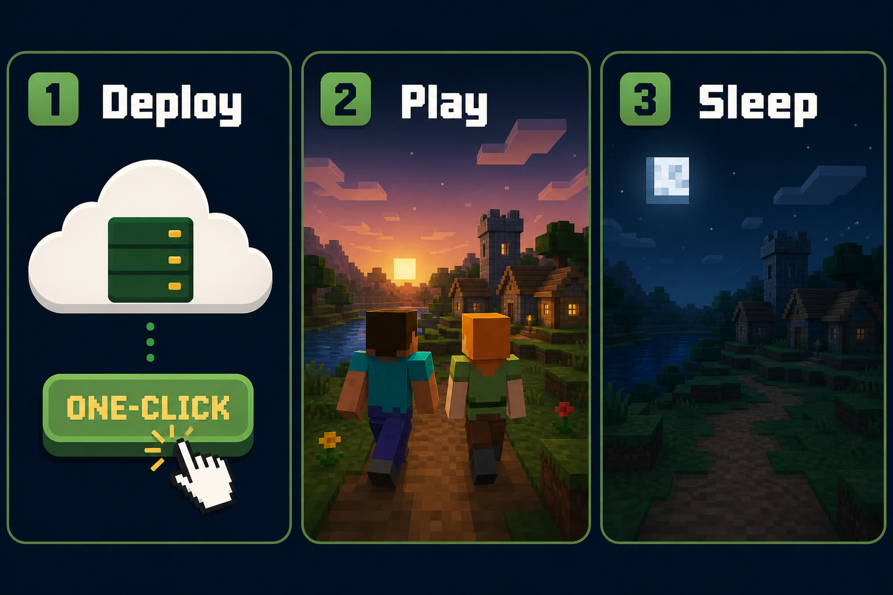

  

<h1 align="center">Roundhouse</h1>

  A Minecraft server that starts when your friends join. 
  One click on Railway. Latest vanilla. Sleeps when idle.

  

  

## How it works

1. Click deploy
2. Share the join address
3. The world wakes when someone connects, and sleeps when they leave

That last part keeps the bill low. You are not paying for an empty server all day.

  

## After you click deploy

Do these once in Railway:

1. Add a volume at `/server/data` so the world is saved
2. Add a TCP proxy on port `25565` and copy that address
3. Set `ADMIN_KEY` to a password you will remember
4. Set `MC_PUBLIC_ADDRESS` to the TCP address so the dashboard can show it

Then open the Railway web URL. That is your dashboard.

  

## What you can do later

The first boot is **latest vanilla Minecraft**. No mods.

From the dashboard you can:

- Start and stop the world
- Switch vanilla, Fabric, Forge, or a modpack
- Keep more than one world
- Make backups
- Add ops and a whitelist

Friends join with the official Minecraft launcher and the same version shown in the dashboard.

## Something wrong?

[Open an issue](https://github.com/rndaom/roundhouse/issues/new/choose). That is the right place for deploy problems, dashboard bugs, and ideas.

## License

MIT. Minecraft belongs to Mojang. This project downloads the official server when it starts.
