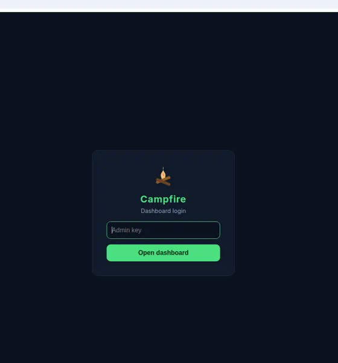
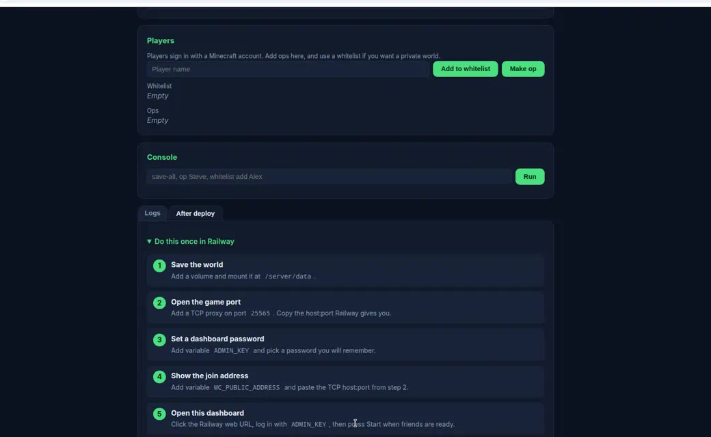
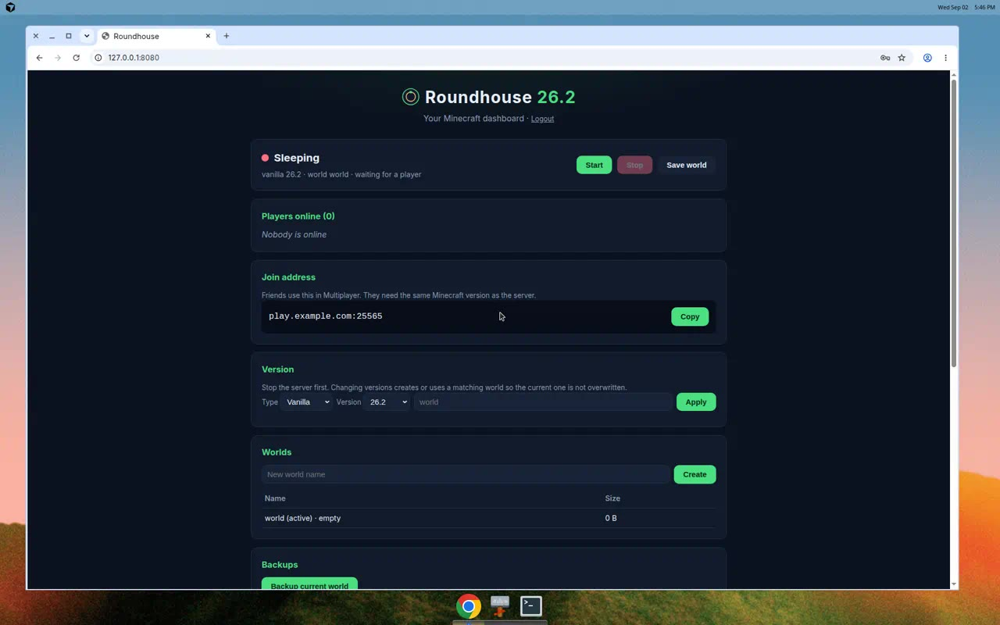
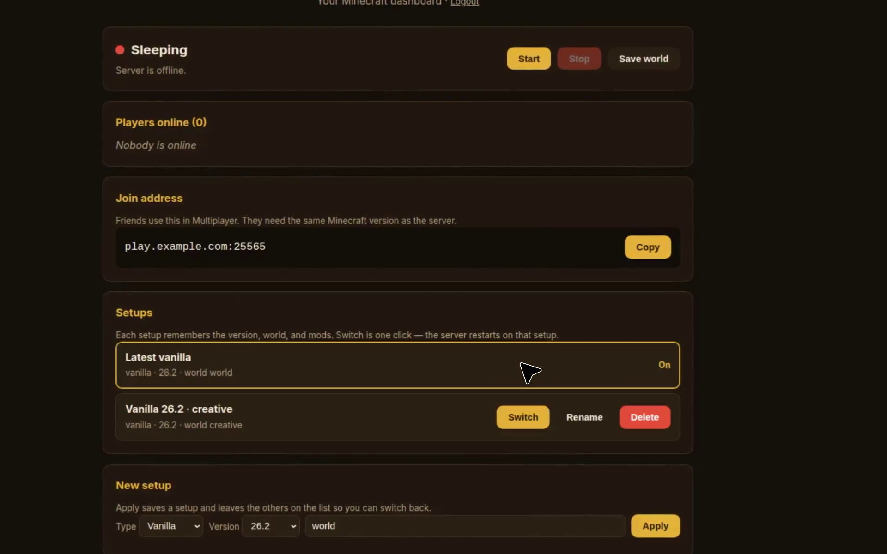

  

<h1 align="center">Powered Rail</h1>

  A Minecraft server that starts when your friends join. 
  One click on Railway. Latest vanilla. Sleeps when idle.

  

## Preview

Login, the gold dashboard, one-click setup switch, and the After deploy steps.

  <video src="docs/assets/preview.mp4" poster="docs/assets/dashboard.jpg" width="920" controls playsinline>
    <a href="docs/assets/preview.mp4">Watch how Powered Rail works</a>
  </video>

  <a href="docs/assets/preview.mp4">Open the preview video</a>

## After you deploy

Do these five things once in Railway, then open the web URL. That URL is this dashboard.

  

  

1. Add a volume at `/server/data`
2. Add a TCP proxy on port `25565` and copy that host:port
3. Set `ADMIN_KEY` to a password you will remember
4. Set `MC_PUBLIC_ADDRESS` to the TCP address
5. Open the Railway web URL and log in with `ADMIN_KEY`

## The dashboard

Latest vanilla is already selected. Press Start when someone wants to play. The server sleeps after ten minutes empty.

  

Saved setups remember the version, world, and mods. Switch is one click — the server restarts on that setup, including the default.

  

Friends join with the official Minecraft launcher and the same version shown at the top of the dashboard.

## Something wrong?

[Open an issue](https://github.com/rndaom/powered-rail/issues/new/choose).

## License

MIT. Minecraft belongs to Mojang. This project downloads the official server when it starts.
