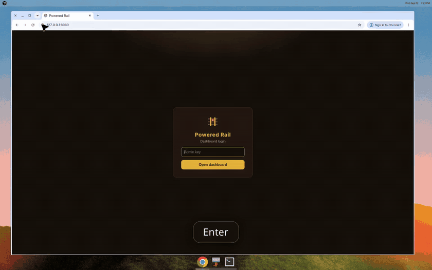

  

<h1 align="center">Railpowered</h1>

  A Minecraft server that starts when your friends join. 
  One click on Railway. Latest vanilla. Sleeps when idle.

  

  The button must be a Railway template (<code>/new/template/…</code>), not a GitHub URL. Publish it once — <a href=".railway/README.md">how</a>.

## Preview

Login, the gold dashboard, one-click setup switch, and the dashboard after deploy.

  

## After you deploy

Open the Railway web URL. Log in with `ADMIN_KEY` from the Minecraft service Variables. Press Start when friends are ready.

The join address fills itself from Railway’s TCP proxy. Latest vanilla is already selected. The server sleeps after ten minutes empty.

Saved setups remember the version, world, and mods. Switch is one click.

Friends join with the official Minecraft launcher and the same version shown at the top of the dashboard.

## Something wrong?

[Open an issue](https://github.com/rndaom/Rail-Powered/issues/new/choose).

## License

MIT. Minecraft belongs to Mojang. This project downloads the official server when it starts.
