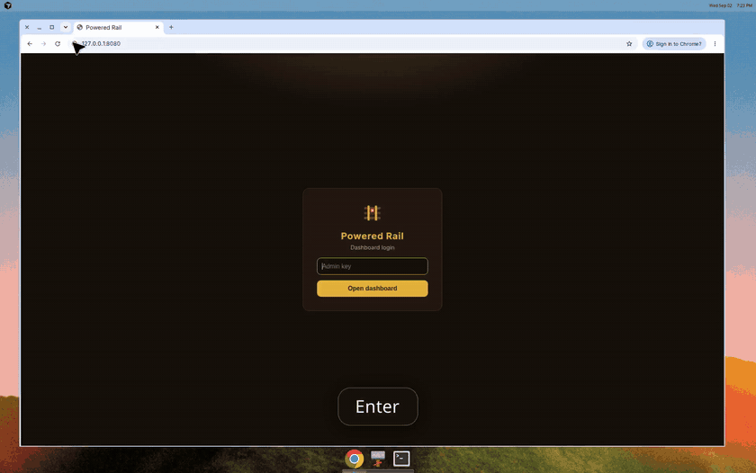

  

<h1 align="center">Railpowered</h1>

  A Minecraft server that starts when your friends join. 
  One click on Railway. Latest vanilla. Sleeps when idle.

  

## Preview

Login, the gold dashboard, one-click setup switch, and the dashboard after deploy.

  

## After you deploy

On Deploy, set `ADMIN_KEY` to a password you will remember. That is the dashboard login. Open the Railway web URL, sign in with it, and press Start when friends are ready.

The join address fills itself from Railway’s TCP proxy. Latest vanilla is already selected. The server sleeps after ten minutes empty.

Saved setups remember the version, world, and mods. Switch is one click.

Friends join with the official Minecraft launcher and the same version shown at the top of the dashboard.

## Performance

New worlds start with an 8-chunk view distance and a 6-chunk simulation distance. These are conservative defaults for a small shared server; you can change them in the persistent `/server/data/server.properties` file while Minecraft is stopped. Existing worlds keep their current values. A shorter simulation distance reduces the chunks that tick around each player, but also reduces the range at which farms and mobs remain active.

The Java heap defaults to `MC_MAX_MEMORY=auto`: it uses at most 2 GiB and leaves room for Java's native memory in containers with lower limits. Set `MC_MAX_MEMORY` explicitly if your world needs a different heap, and keep `MC_MIN_MEMORY` below it. A 1 GiB Railway container cannot be expected to host a busy modern world; the automatic heap is about 700 MiB there.

If play feels slow, distinguish delayed blocks or mobs from slow joining and low client FPS. During play, check Railway CPU and memory graphs and the server log for `Can't keep up` or out-of-memory errors. On vanilla, run `tick query` in the dashboard console to inspect tick rate. Measure while the lag is happening before changing Minecraft versions. Back up the world before upgrading; do not open an upgraded world with an older server version.

## Something wrong?

[Open an issue](https://github.com/rndaom/Railpowered/issues/new/choose).

## License

MIT. Minecraft belongs to Mojang. This project downloads the official server when it starts.
